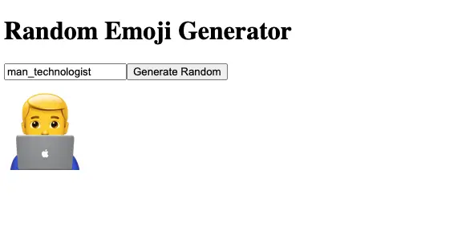
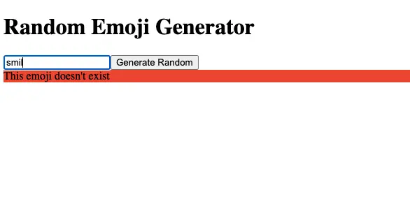

# React Random Emoji Generator

A random emoji generator in React

- Random emoji when page loads
- Clicking on button causes new random emoji to be shown
- Choose an emoji by name
- Error is shown if invalid emoji name entered

